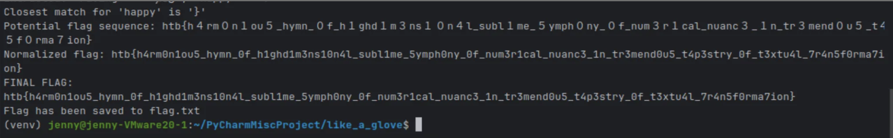
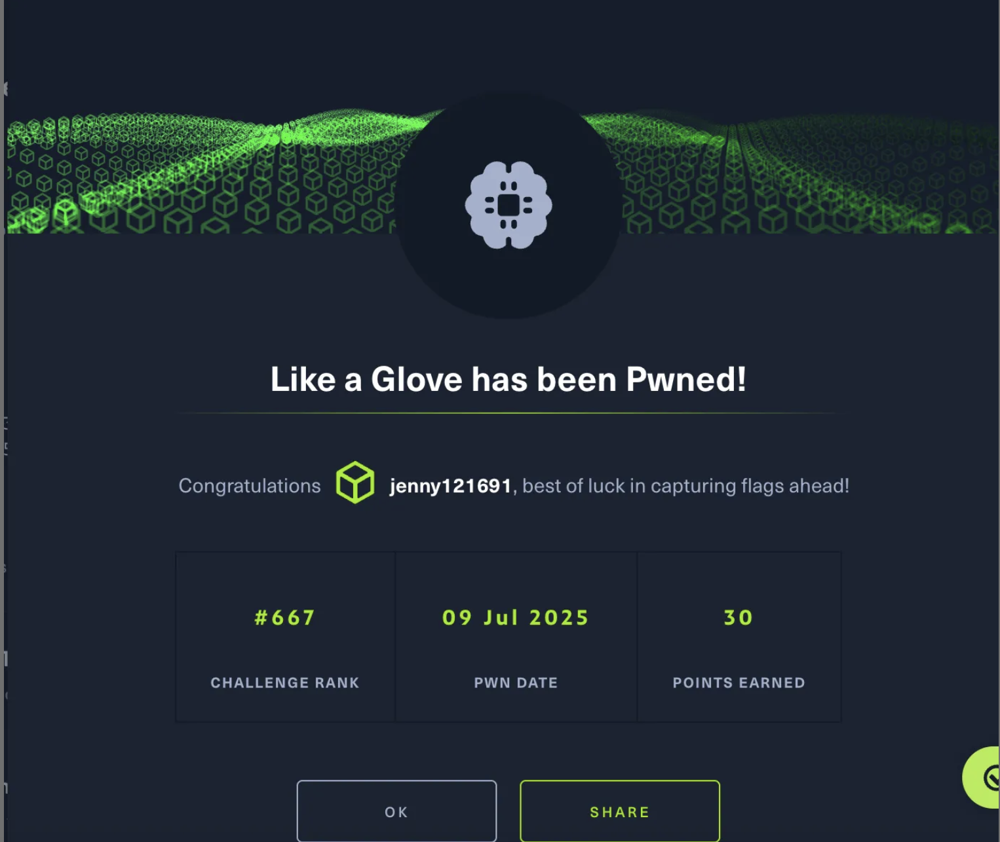

## 💡 Like a Glove 

### Introduction of the task

  For this task, I chose an ML-based challenge rather than a web-oriented one. In my other write-ups, I had previously performed web app vulnerabilities, but for this one, I wanted to challenge myself further by understanding how machine learning models could be manipulated or attacked. 
  
  The aim was to go beyond the traditional web exploitation and gain experience on analyzing and attacking an ML model through code-based interactions. I learned to think more as a developer and an analyst than just as a pentester.

### 🛠️ Process of solving Like a Glove

1. We download the file for the traget machine i renamed the file into challenge.txt.

   This is the file that it shows after i download it.

   <pre>
     
     Like non-mainstream is to efl, battery-powered is to?
     Like sycophancy is to بالشهادة, cont is to?
     Like беспощадно is to indépendance, rs is to?
     Like ajaajjajaja is to hahahahahahahahaahah, ２ is to?
     Like bahno is to arbus, duit is to?
     Like 잡히지 is to ਮੈਂ, 年度第 is to?
     Like usaar is to est-ce-que, ７ is to?
     Like وشعب is to nordeste, rêve is to?
     Like teapots is to glow, ４１ is to?
     Like run-ins is to biggy, update is to?

   </pre>

   🔍 What i inferred:
     I guess it represent words as vertors, Like A is to B, C is to ?

     I can solve these analogies using vertor arithmetic:

     " B - A + C = D ".

2. The tools and the enviornment that i used:

   I download the "glove.twitter.27B.25d.txt" model, created a main.py script, and get in to the virtual enviornment.
   
   First , we get into the virtual enviornment by the command:

   ```bash
   
   source venv/bin/activate
   
   ```
   
   To download the "glove.twitter.27b.25d.txt" by the following command:

   ```bash
   
   wget http://nlp.stanford.edu/data/glove.twitter.27B.zip
   
   unzip glove.twitter.27B.zip
   ```
   After download the model and get into the virtual enviornment, we need to create a main.py:

   ```bash

   touch main.py

   ```
   

   ✅ Why I downloaded the GloVe model:

   I noticed that the challenge provided only a challenge.txt file with analogy-type questions like:

   A is to B, C is to ?

   This looks strikingly similar to a common task in natural language processing using word embeddings to capture relations between words through vector arithmetic . I thus expected that a pre-trained word embedding model such as GloVe would likely be needed.

    So I utilized the GloVe Twitter dataset (25d) as it strikes a nice balance of being minimal and well having decent overall coverage.
  
   ✅ Why I created main.py:
   
   As no initial code was provided, and the task is:
   
   - Reading the challenge file
     
   - Loading the GloVe model
     
   - Vector math
     
   - Outputting the result

    I decided to create my own script (main.py) to automate the entire pipeline. The script imports the model, tokenizes every line, does the answer via vector calculations, and outputs the final flag.
   
   ✅ Why I used the virtual enviornment:

   To keep my working environment tidy and make sure that all dependencies are properly in place, I utilized a Python virtual environment.

3.  This is the main.py that i created.

   ```bash

   import re
from gensim.models import KeyedVectors

# Import the glove_model
def load_glove_model():
    model_path = "glove.twitter.27B/glove.twitter.27B.25d.txt"
    # Load the format -> GloVe is a text file (binary = False), and GloVe has no header -> no_header = True
    model = KeyedVectors.load_word2vec_format(model_path, binary=False, no_header=True)
    # Can be used to query word vectors
    return model

# Start analyzing the challenge file
def parse_challenge(file_path, model):
    # Open the challenge file
    with open(file_path, 'r') as file:
        # Read each line from the file
        lines = file.readlines()
    
    # Array to store unused variables -> e.g. like, is, to ...
    results = []
    # Array to store inferred characters from each question
    flag_characters = []
    
    # Loop through each line using enumerate() to get both index and line content
    for i, line in enumerate(lines):
        
        # e.g. Like king is to queen, man is to? -> split into king queen man
        match = re.search(r"Like (.+?) is to (.+?), (.+?) is to\?", line.strip())
        if not match:
            # Try another format if the first regex fails
            match = re.search(r"Like (.+) is to (.+), (.+) is to\?", line.strip())
            # If still no match, skip this line
            if not match:
                continue
        
        # e.g. Like king is to queen, man is to? -> extract king, queen, man
        # Store as key = king, value = queen, query = man
        key, value, query = match.groups()
        key = key.strip()
        value = value.strip()
        query = query.strip()
        print(f"Extracted: '{key}' -> '{value}', '{query}' -> ?")
             
        try:
            # Track words not found in the model
            missing_words = []
            # Loop through key, value, query and check if any is not in the model
            # model is the GloVe word vector loaded using gensim
            for word in [key, value, query]:
                if word not in model:
                    missing_words.append(word)
            # If any word is not in the loaded model, print error and skip
            if missing_words:
                print(f"Skipping due to missing words: {missing_words}")
                continue
                
            # result = B - A + C = D
            result_vector = model[value] - model[key] + model[query]
            # positive=[result_vector]: means we're looking for the most similar word to this vector
            # topn=1 -> only retrieve the top most similar word
            # [0][0] -> first [0] gets the top tuple, second [0] gets the word itself from the tuple
            closest_word = model.most_similar(positive=[result_vector], topn=1)[0][0]
            
            print(f"Closest match for '{query}' is '{closest_word}'")
            
            # If no error, add this challenge result to the final list
            flag_characters.append((i, query, closest_word))
        # Catch errors if encountered during vector operations
        except KeyError as e:
            print(f"Error: {e}")
            continue
    
    # From each tuple (i, query, closest_word) in flag_characters
    # extract closest_word -> index 2 element, to form a list
    mapped_chars = [char[2] for char in flag_characters]
	
    # Join all words together to form the potential flag
    potential_flag = ''.join(mapped_chars)
    print(f"Potential flag sequence: {potential_flag}")
    
    # Convert full-width numbers to half-width ASCII digits
    normalized_flag = potential_flag
    # A dictionary for full-width to ASCII mapping
    replacements = {
        '０': '0', '１': '1', '２': '2', '３': '3', '４': '4',
        '５': '5', '６': '6', '７': '7', '８': '8', '９': '9'
    }
    
    # Loop through replacements and apply the conversion
    for non_ascii, ascii_char in replacements.items():
        normalized_flag = normalized_flag.replace(non_ascii, ascii_char)
    # Print the final converted flag
    print(f"Normalized flag: {normalized_flag}")
    return normalized_flag

# Ensure this script runs only when executed directly
if __name__ == "__main__":
    challenge_file = "challenge.txt"
    # Call the previously defined load_glove_model() function
    # to load GloVe word embeddings into a model
    model = load_glove_model()
    # Find the closest word for each analogy
    flag_sequence = parse_challenge(challenge_file, model)
    print("FINAL FLAG:")
    print(flag_sequence)
    
    # Open a file named flag.txt
    with open('flag.txt', 'w') as flag_file:
        # Write the flag into flag.txt
        flag_file.write(flag_sequence)
    print(f"Flag has been saved to flag.txt")
   ```


4. The concept of main.py is :

   - Reading challenge line by line
     
   - Parsing out A, B, and C
     
   - Performing the vector math to get D
     
   - Collecting all D results to construct the flag
   
   - normalizing full-width digits to ASCII
   
   - Outputting resulting content to flag.txt

  5. After running the main.py by using the command:

      ```bash
      
       python main.py
      
      ```

     I got the flag.

     Falg:
     htb{h4rm0n1ou5_hymn_0f_h1ghd1m3ns10n4l_subl1me_5ymph0ny_0f_num3r1cal_nuanc3_1n_tr3mend0u5_t4p3stry_0f_t3xtu4l_7r4n5f0rma7ion}
    
    
## Summary of this task 
  This challenge took me out of my comfort zone of web-based penetration testing into the world of machine learning and NLP. With just a challenge.txt file with analogy-type questions, I had to:
  
  - Recognize that this could likely be resolved using vector math with word embeddings.
    
	-	Download and use the GloVe Twitter 25d model to learn semantic relations.
    
	- Write a custom Python script (main.py) that:
    1.  Parses the analogies
    2.  Computes vector differences and additions
    3.  Finds each query's most semantically similar word
    4.  Builds a potential flag
    5.  Normalizes full-width characters to ASCII
    6.  Outputs the final flag to flag.txt.
     
Rather than exploiting network requests or UI components, this challenge was about reasoning, scripting, and playing with embeddings, which offered a different type of challenge.


## Challenge faced
  - Words not present in the model:
    
    Some analogy inputs were not in the GloVe vocabulary. I handled these elegantly in code by skipping over missing entries, but it meant that a few lines were not usable in the final flag.
  
  - Identifying the analogy pattern:
    
    The format of the challenge lines was not quite uniform, so I had to allow for a few regex patterns to extract the A-B-C structure reliably.

  - Vector math problems:
    Occasionally, I encountered KeyError exceptions for missing or malformed input. It was useful to trap these exceptions early to allow the script to continue uninterrupted.

  - Full-width character conversion:
    Some of the predicted words included full-width Unicode characters (e.g., １, ２, etc.,) that required a final normalization step to translate them into valid ASCII digits for flag reconstruction.
